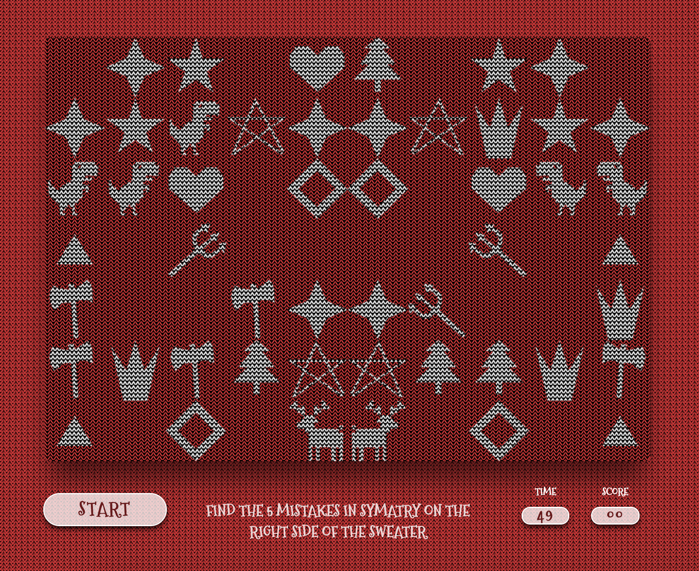

# Fix The Sweater

Fix the Sweater is a puzzle game based on Holiday CSSweater Generator generator by Adam Kuhn (https://codepen.io/cobra_winfrey/pen/ZEYzMBj).



### Goal

The goal of the game is to find the mistakes in simatry on the right side of the sweater. There are 5 mistakes on every sweater. As soon as you find the 5, a new sweater pattern is generated with 5 new mistakes. Find as many mistakes as you can before the time is up.
https://romanmendez.github.io/project-xmas-sweater/

# Code

The patterns on the sweater and all the game logic is done in Javascript and painted into de canvas with the `getConext("2d")` method.

## Background

The document background and sweater canvas background are done with CSS, taken directly from the Holiday CSSweater Generator.

The figures background is done by created a small canvas element which has a hidden visibility on the DOM and is then used as a fillStyle when paiting the figures.

```javascript
this.ctx.scale(0.7, 0.7);
this.ctx.fillStyle = "black";
this.ctx.fillRect(0, 0, this.width, this.height);
let backgrounPoly = [0, 5, 3, 10, 7, 10, 10, 5, 10, 0, 5, 8, 0, 0];
this.ctx.beginPath();
this.ctx.moveTo(backgrounPoly[0], backgrounPoly[1]);
for (let i = 0; i < backgrounPoly.length; i += 2) {
  this.ctx.lineTo(backgrounPoly[i], backgrounPoly[i + 1]);
}
this.ctx.fillStyle = "white";
this.ctx.fill();
this.ctx.closePath();
```

## Figures

The figures on the sweater are generated with polygon coordinates taken from Adam Kuhn's generator and transformed into arrays of X,Y coordinates that are painted one by one using a for loop.

For example, here is the star coordinates array:

`star: [50, 0, 61, 35, 98, 35, 68, 57, 79, 91, 50, 70, 21, 91, 32, 57, 2, 35, 39, 35]`

This array is drawn using the draw method and the drawMirror method in the Figure class:

```javascript
draw(sX, sY) {
    this.ctx.beginPath();
    this.ctx.moveTo(sX + this.figure[0], sY + this.figure[1]);
    for (let i = 0; i < this.figure.length; i += 2) {
      this.ctx.lineTo(sX + this.figure[i], sY + this.figure[i + 1]);
    }
    this.ctx.fillStyle = this.ctx.createPattern(this.background, "repeat");
    this.ctx.fill();
    this.ctx.closePath();
  }

drawMirror(sX, sY) {
    this.ctx.save();
    this.ctx.translate(this.canvasWidth, 0);
    this.ctx.scale(-1, 1);
    this.ctx.clearRect(sX, sY, 100, 100);
    this.ctx.beginPath();
    this.ctx.moveTo(sX + this.figure[0], sY + this.figure[1]);
    for (let i = 0; i < this.figure.length; i += 2) {
      this.ctx.lineTo(sX + this.figure[i], sY + this.figure[i + 1]);
    }
    this.ctx.fill();
    this.ctx.closePath();
    this.ctx.restore();
  }
```

## Sweater

A new sweater pattern is generated randomy every time the game is loaded or after the player has fixed the 5 symetry mistakes.

### Grid

The Sweater class creates a grid of 100x100 squares based on the width and height of the canvas element. The grid array stores arrays with XY positions.

```javascript
for (let c = 0; c < this.height; c += 100) {
  let position = [];
  for (let r = 0; r < this.width; r += 100) {
    position.push([r, c]);
  }
  this.grid.push(position);
}
```

The grid is then radomized using an algorhythm that ensures no repeating values:

```javascript
randomizer(array) {
    for (var j, x, i = array.length; i; j = parseInt(Math.random() * i), x = array[--i], array[i] = array[j], array[j] = x);
    return array;
  }

  this.randomizer(this.grid);
    this.grid.forEach(e => {
      this.randomizer(e);
    });
```

After the grid is created and the positions are randomized, a random figure from the figures array is added to the positions array inside the grid array.

```javascript
this.grid.forEach(line =>
  line.forEach(position => {
    let randomE = Math.floor(Math.random() * this.figures.length);
    position.push(this.figures[randomE]);
  })
);
```

The resulting grid array looks like this:

```javascript
[
  [[posX, posY, Figure],[posX, posY, Figure],[posX, posY, Figure],[posX, posY, Figure],[posX, posY, Figure]],
  [[posX, posY, Figure],[posX, posY, Figure],[posX, posY, Figure],[posX, posY, Figure],[posX, posY, Figure]],
  [[posX, posY, Figure],[posX, posY, Figure],[posX, posY, Figure],[posX, posY, Figure],[posX, posY, Figure]],
  [[posX, posY, Figure],[posX, posY, Figure],[posX, posY, Figure],[posX, posY, Figure],[posX, posY, Figure]],
  ...
]
```

### Variations

Once we have the grid of randomized positions with a figure added to each one, we add the variations.

In the first part of this code we go through the grid array and for each position array we create a copy of the `this.figures` array and remove the figure in the current position. Then we randomize the `figuresCopy` array and add the element to the grid's current position array, next to the original figure. This leaves us with a position array containing XY positions and 2 figure objects that are never the same.

```javascript
this.grid.forEach(line =>
  line.forEach(position => {
    let figuresCopy = this.figures.slice();
    figuresCopy.splice(figuresCopy.indexOf(position[2]), 1);
    let randomE = Math.floor(Math.random() * figuresCopy.length);
    position.push(figuresCopy[randomE]);
  })
);
```

Then we add all the grid's position arrays to a new array. That array is randomized and is used to create the variations array holding all the positions where there is a variation in the symetrical design, and a blanks array where there will be no figure. To ensure that no blanks are draw over the variations, the array of blanks is taken from all the positions after the varations.

```javascript
this.randomizer(this.variations);
this.blanks = this.variations.slice(this.variationsNumber, this.blanksNumber + this.variationsNumber);
console.log(this.blanks);
this.variations.splice(0, this.variations.length - this.variationsNumber);
```

### Draw

Once the grid, variations and blank spaces are created, we draw. First we draw a symetrical design, and then we overwrite the variations and the blank spaces.

```javascript
this.grid.forEach(line =>
  line.forEach(position => {
    position[2].draw(position[0], position[1]);
    position[2].drawMirror(position[0], position[1]);
    for (let i = 0; i < this.variationsNumber; i++) {
      if (position === this.variations[i]) {
        position[3].drawMirror(position[0], position[1]);
      }
    }
  })
);
this.blanks.forEach(position => {
  this.ctx.clearRect(position[0], position[1], 100, 100);
  this.ctx.clearRect(this.width * 2 - 100 - position[0], position[1], 100, 100);
});
```
